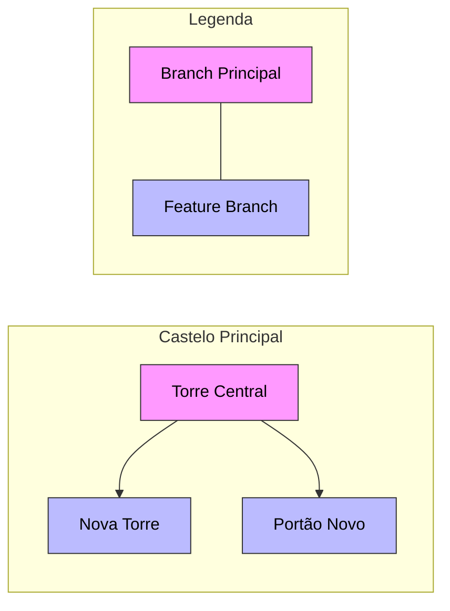

<!-- Título -->
# Utilizando Branches

***Conteúdo da Aula:***

Aula de hoje é sobre como utilizar branches no Git. Vamos aprender a criar, gerenciar e unir branches, mantendo nosso projeto organizado e seguro.

## :memo: Explicação do Processo

### O que são Branches?

Branches são como caminhos diferentes em um projeto. Imagine que você está construindo um castelo de blocos:

- O branch principal (main) é como o castelo principal.
- Os outros branches são como versões alternativas onde você pode experimentar coisas novas.
- Assim como você pode construir uma torre diferente sem afetar o castelo principal.



No diagrama acima, podemos ver:

- A Torre Central representa o nosso branch principal (main).
- As novas estruturas (Nova Torre e Portão Novo) são como branches separados onde estamos fazendo mudanças.
- Assim como no castelo, cada nova estrutura pode ser desenvolvida independentemente sem afetar a torre central.

### Vocabulário Básico:

- `Branch` &#8594; Como uma estrada ou caminho separado onde você pode fazer mudanças.
- `Commit` &#8594; Uma foto do seu castelo mostrando como ele está naquele momento.
- `Merge` &#8594; Quando você junta duas estruturas (como colocar uma nova torre de volta no castelo principal).

### Comandos Principais:

1. **Criar um novo branch** (como começar uma nova construção):

    ```bash
    git checkout -b minha-nova-torre
    ```

    &#8594; É como pegar os blocos e começar a construir em um lugar diferente.

2. **Verificar em qual branch você está** (como olhar para o chão e ver onde está pisando):

    ```bash
    git branch
    ```

    &#8594; Mostra todas as estradas disponíveis e marca com * a que você está usando agora.

3. **Voltar para o branch principal** (como retornar à torre central):

    ```bash
    git checkout main
    ```

    &#8594; Leva você de volta ao castelo principal.

4. **Unir as mudanças** (como colocar a nova torre no lugar):

    ```bash
    git merge minha-nova-torre
    ```

    &#8594; Junta sua nova construção com o castelo principal.

### Cuidado!

- Sempre certifique-se de salvar suas mudanças antes de trocar de branch.
- Não faça mudanças importantes diretamente no branch principal.
- Se algo der errado, é mais fácil consertar em um branch separado.

### Exercício Prático:

1. Crie um novo branch chamado "janela-nova".
2. Faça algumas mudanças pequenas.
3. Volte para o branch principal.
4. Tente unir as mudanças.
5. Observe como seu projeto continua intacto mesmo se algo não sair conforme esperado.

> [!IMPORTANT]\
> **Boas práticas**:
>
> - Sempre crie branches para novas funcionalidades ou correções.
> - Mantenha o branch principal limpo e estável.
> - Use nomes descritivos para seus branches, como "nova-torre" ou "correcao-portao".

---

> [!WARNING]\
> **Recomendações**:
>
> - Sempre faça mudanças em um branch separado.
> - Teste suas mudanças antes de unir ao branch principal.
> - Comunique-se com sua equipe sobre as mudanças que está fazendo.

---

> [!NOTE]\
> **Observações**:
>
> - Mantenha seus branches atualizados com o branch principal.
> - Use mensagens de commit claras e descritivas.
> - Revise suas mudanças antes de fazer um merge.

---

### :clipboard: Próximos Passos

- Pratique criando e unindo branches em projetos pequenos.
- Explore como branches podem ajudar a organizar seu trabalho em equipe.
- Entenda como resolver conflitos ao unir branches diferentes.
- Experimente diferentes fluxos de trabalho com branches.

### :bulb: Dicas do Especialista

- Assim como um castelo pode ter muitas torres diferentes, um projeto pode ter muitos branches.
- Cada um serve para uma finalidade específica, mantendo tudo organizado e seguro.

### :bookmark: Tags

`#Branches` `#Git` `#ControleDeVersão` `#Desenvolvimento` `#Colaboração`

<!-- Informações -->
### &#8505; Informações


&nbsp;

&nbsp;

&nbsp;

&nbsp;

&nbsp;

&nbsp;

